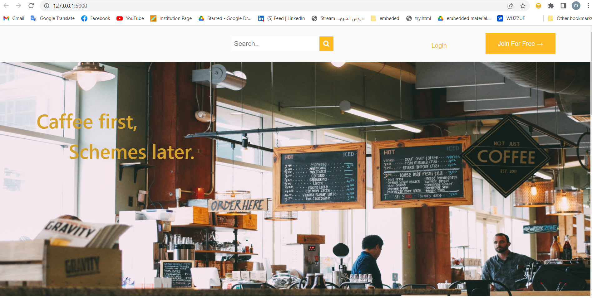
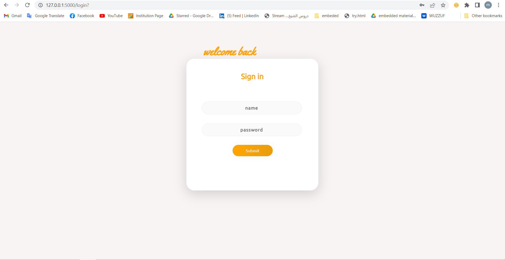
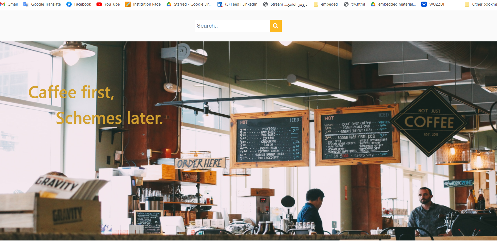
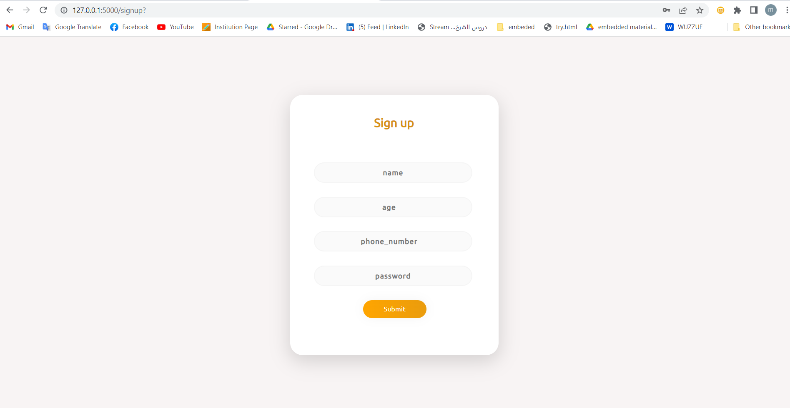

## For runing the webpage please follow this steps

#### 1-create a database on PhpMyAdmin with the name(cafe) 
#### 2- inside the database create a table with name (users) with 4 columns(name,age,password and phone_number)
##### (this database is for logging to the web page)

#### 3-Run webpage.py to go into the localhost web page

#### The home page
 

#### When the user clicks on the login button he moves to the login page (login.html)

 

#### After entering a saved username and password (in database) user moves back to the home page (userhomepage.html)

 

#### when clicking on (Join for free), the user moves to sign up form (signup.html) to create a new account

 

##### and here is a gif of all steps of showing the dealing with database and for running the code

